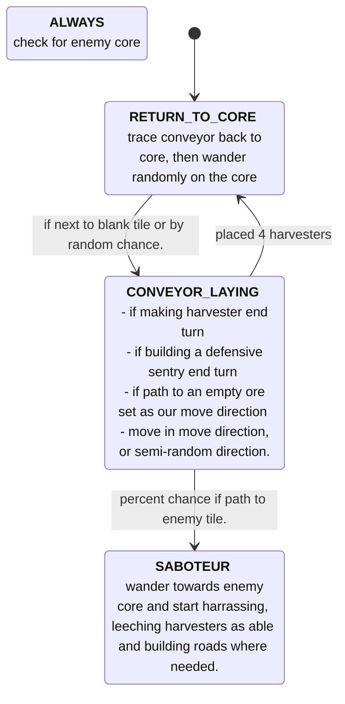

```mermaid
stateDiagram-v2
  RETURN_TO_CORE: <b>RETURN_TO_CORE</b> <br> trace conveyor back to core, then wander randomly on the core

  CONVEYOR_LAYING: <b>CONVEYOR_LAYING</b> <br> - if making harvester end turn <br> - if building a defensive sentry end turn <br> - if path to an empty ore set as our move direction <br> - move in move direction, or semi-random direction.

  SABOTEUR: <b>SABOTEUR</b> <br> wander towards enemy core and start harrassing, leeching harvesters as able and building roads where needed.

  ALWAYS: <b>ALWAYS</b> <br> check for enemy core

  [*] --> RETURN_TO_CORE
  RETURN_TO_CORE --> CONVEYOR_LAYING : if next to blank tile or by random chance.
  CONVEYOR_LAYING --> RETURN_TO_CORE : placed 4 harvesters
  CONVEYOR_LAYING --> SABOTEUR : percent chance if path to enemy tile.
```
